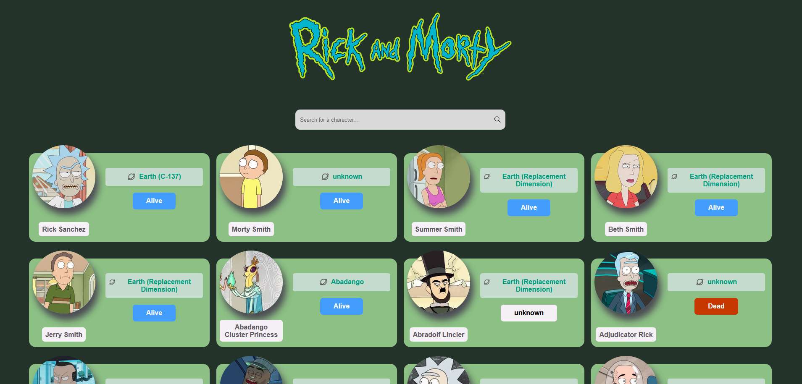

  
  <h1 >🪐 Rick and Morty Project</h1>
  

 

  

### 🌌 Overview

    Dive deep into the captivating realms of the Rick and Morty universe with this interactive web application. Crafted meticulously with Next.js and GraphQL, users can
    explore detailed cards showcasing characters, fascinating episodes, and mysterious planets. Tailored for everyone - whether you're a seasoned fan or just starting your
    interdimensional journey - our application promises a sleek, responsive, and intuitive exploration of  the series.

### 💡 Features

    📚 Detailed Cards: Unearth specifics about your favorite characters, recall epic episodes or wander through alien worlds.
    💼 Intuitive UI: Seamlessly navigate through the multiverse with a user-friendly interface.
    🌐 Responsive Design: Explore from any device, ensuring a consistent experience whether you're on desktop, tablet, or mobile.

### 🛠 Technologies

To ensure a robust and seamless user experience, our project incorporates a stack of state-of-the-art technologies:

    - Core Development:
        - Next.js - Robust React framework.
        - GraphQL - Query language for APIs.
        - Apollo Client - State management library for JavaScript that enables you to manage both local and remote data with GraphQL.
        - TypeScript - Superset of JavaScript that adds static types.
    - Testing & Documentation:
        - Jest - Delightful JavaScript testing.
        - React Testing Library - Light-weight solution for testing React components.
        - Storybook - Tool for developing UI components in isolation.
    - Animations & Interactivity:
        - Three.js - 3D library.
        - Framer-motion - Open source motion library for React.
